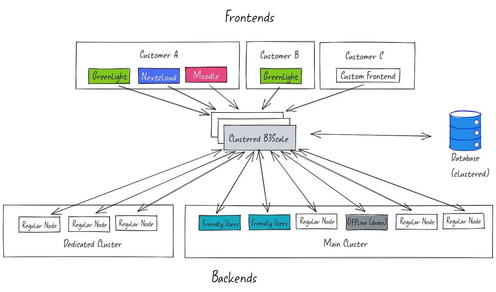

# Overview

{ loading=lazy }
<figure markdown>
  <figcaption>b3scale architecture overview</figcaption>
</figure>

## Concepts

BigBlueButton arrives with a simple concept: One API, one frontend, usually Greenlight, authenticated through an API secret. As a scaler and
load balancer for BigBlueButton, b3scale expands on that by introducing additional concepts:

* **Node:** An individual installation of BigBlueButton
* **Backend:** A BigBlueButton Node made available as a resource to b3scale
* **Frontend:** A frontend is used to distinguish multiple tenants. It is a tuple of a frontend name, an instance and JSON-encoded settings valid for that frontend.
* **Tags:** Used to associate one or more frontends with one ore more backends (n:m relation)
* **Metrics:** b3scale provides [Prometheus](https://prometheus.io/)-compatible metrics about front- and backends
* **JWTs**: [JSON Web-Tokens](https://jwt.io/) are used to authorize services with b3scale 

## Components

b3scale consists of several components:

* **Database:** b3scale requires a Postgres-Database as storage backend
* **b3scaled:** The central scaling service that accepts requests from frontends and distributes them to backends
* **b3scalectl:** The command line tool, a wrapper
* **b3scaleagent:**  An agent process that reports status and health of a backend to the central scaling service using a REST API
* **b3scalenoded (*deprecated*):** Like *b3scaleagent*, but connects directly to the database 
