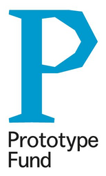

## infra.run

{ align=right }
[infra.run](https://infra.run) is a Berlin based hosting and services company
focussing on the education and non-for-profit sectors. infra.run has sponsored
b3scale to create a flexible scaler and loadbalancer for BigBlueButton with a
focus of multi tenancy. The goal: provide a scalable, privacy conserving and
efficient video call solutation at an affordable price that is second to none.
infra.run continously invests in b3scale to improve upon its capabilities and
features.

{ align=right }
## Prototype Fund

The [Prototype Fund](https://prototypefund.de/) is a funding program of the
Federal Ministry of Education and Research (BMBF) that is managed and evaluated
by the Open Knowledge Foundation Germany.  Individuals and small teams (of
freelance coders, hackers, UX designers and more) can receive funding in order
to test their ideas and develop open source applications in the areas of Civic
Tech, Data Literacy, IT Security and Software Infrastructure. We aim to keep
innovation processes as well as infrastructures open and accessible.

The Prototype Fund has sponsored the initial development of b3scale.
